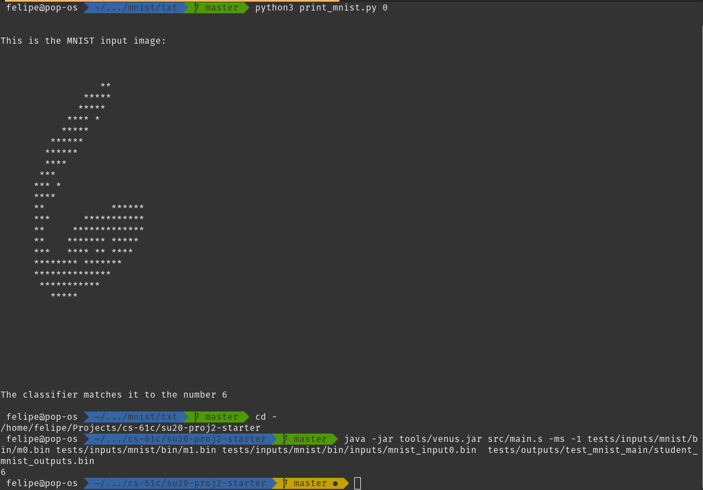
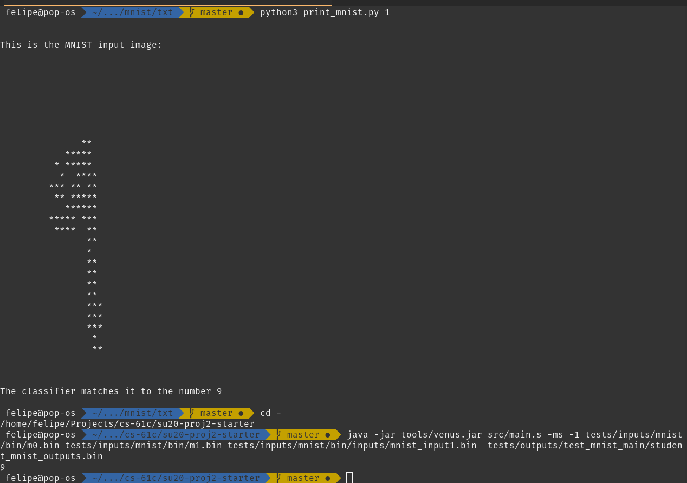
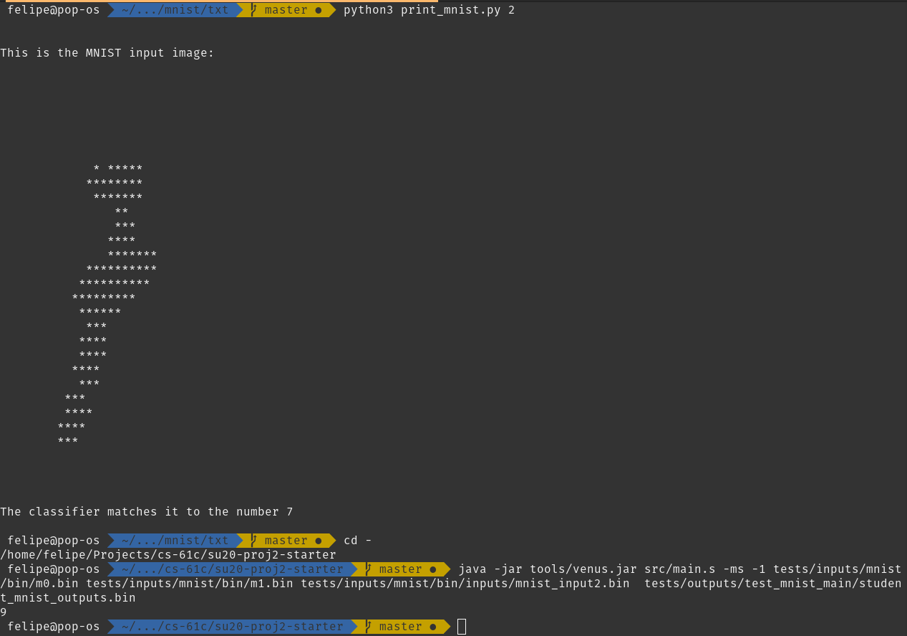

# UC Berkeley - CS 61C - Project 2
## A Neural Network written completely in RISC-V assembly for handwritten digit classification
This is my solution proposal to the project described
[here](https://web.archive.org/web/20230123130441/https://inst.eecs.berkeley.edu/~cs61c/su20/projects/proj2/#task-32-matrix-multiplication).

## Some results from this solution

